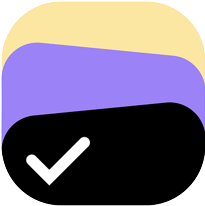

#  ToDoApp

Introducing ToDoApp. Your ultimate task managing solution.

### Features
✅ Create tasks with deadline

✅ Create task groups with individual color

✅ Assign tasks to groups

✅ Manage completed tasks, pending tasks, missed tasks etc.

✅ Get todays tasks.

### Frontend Framework
<p align="center">

</p>
<p align="center">
<font size="5">
<b>Vue JS 3</b>
</font>
</p>

### Backend Framework
<p align="center">

</p>
<p align="center">
<font size="5">
<b>Djnago</b>
</font>
</p>

### API Framework
<p align="center">

</p>
<p align="center">
<font size="5">
<b>Djnago Rest Framework</b>
</font>
</p>

---
### Frontend project setup
```shell
cd to-do-frontend
```
Must have node.js installed on your setup

```shell
npm install
```
### Compile and Hot-Reload for Development
```shell
npm run dev
```
### Compile and Hot-Reload for Development
```shell
npm run build
```
---
### Backend project setup
```shell
cd to-do-backend
```
Install virtual enviroment
```shell
pip install -r requirements.txt
```
Start virtual environment (ps1 for PowerShell)
```shell
..\devenv\Scripts\activate.ps1
```
Start Server
```shell
python manage.py runserver 192.168.0.9:8000
```